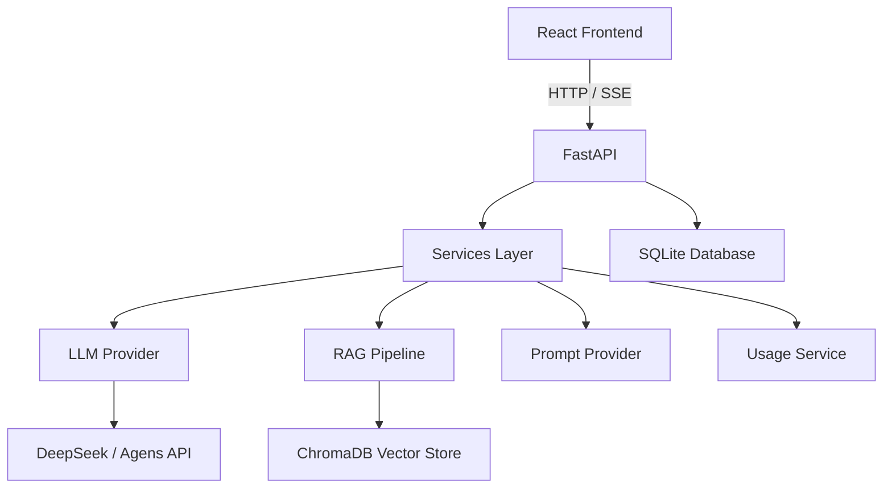

# knowledge_chat — 企业级 AI 知识库问答平台

> Enterprise AI Knowledge Assistant

基于 FastAPI + React 的 AI 知识库问答平台，支持企业知识库管理、RAG 增强问答、普通 AI 闲聊、多模型 Provider、Prompt 工程管理及用户资源隔离。

---

## 1. 项目介绍

knowledge_chat 是一个面向企业场景的 AI 知识库问答系统，具备以下核心能力：

- **企业知识库管理**：创建、配置、隔离多个知识库
- **RAG 增强问答**：全链路检索增强生成，自动标注引用来源
- **普通 AI 闲聊**：多轮对话、流式输出、上下文记忆
- **多模型 Provider**：抽象 LLM Provider 层，支持 DeepSeek / Agens，一键切换
- **Prompt 工程管理**：模板 CRUD、版本管理、缓存、运行时动态加载
- **用户资源隔离**：多用户环境下 Knowledge Base、Document、Conversation 完全隔离

---

## 2. 核心功能

### AI Chat Workspace

ChatGPT 风格对话界面，提供两种交互模式：

- **知识库问答模式**：基于选定知识库进行 RAG 问答，回答附带引用来源
- **普通闲聊模式**：不检索知识库，直接调用 LLM 进行通用对话
- **Streaming 流式回复**：SSE 实时推送，打字机效果
- **会话历史管理**：Conversation 级别对话记录持久化
- **知识库切换**：运行时切换当前对话关联的知识库

### Knowledge Base

完整的知识库生命周期管理：

- 创建 / 删除知识库
- 文档上传（PDF、DOCX、MD、TXT）
- 自动文档解析
- Chunk 切分（可配置 chunk_size / chunk_overlap）
- 向量化存储至 ChromaDB
- 用户级别知识库隔离

### RAG Pipeline

```
Document
   ↓  Parser（文件解析）
Chunker（文本切分）
   ↓  Embedding Provider（向量化）
Vector Store（ChromaDB）
   ↓  Retriever（向量检索）
Citation Builder（来源标注）
   ↓  LLM（答案生成）
```

### Citation（引用追踪）

系统支持结构化来源追踪，每次 RAG 回答附带：

- 文档名称（filename）
- Chunk ID
- 相关度评分（score）
- Metadata 元数据

前端 CitationCard 组件展示引用卡片，支持点击查看来源详情。

### Multi Model Provider

抽象 LLM Provider 层，统一 `LLMProvider` 接口：

| Provider | 状态 | 说明 |
|----------|------|------|
| DeepSeek | ✅ 已支持 | OpenAI 兼容 API，Stream + JSON |
| Agens | ✅ 已支持 | OpenAI 兼容 API，Stream |

通过 `.env` 配置一键切换：

```bash
LLM_PROVIDER=deepseek   # 或 agens
```

新增 Provider 只需实现 `LLMProvider` 接口并在工厂注册即可。

### Prompt Engineering

完整的 Prompt 模板工程体系：

- **PromptTemplate**：模板 CRUD，支持 name / type / content / enabled
- **PromptVersion**：自动版本快照，历史回滚
- **Prompt Cache**：内存缓存，减少数据库查询
- **Runtime Loading**：运行时动态加载，支持 Database / Default 两种 Provider

### Usage Tracking（用量追踪）

记录每一次 LLM 调用的详细信息：

- Provider & Model
- Token 消耗（prompt_tokens / completion_tokens / total_tokens）
- 延迟（latency_ms）
- 关联 Conversation

前端 Usage 页面提供用量统计面板。

### User Isolation（用户隔离）

多用户环境下资源完全隔离：

- Knowledge Base（知识库归属）
- Documents（文档归属）
- Conversations（会话归属）
- Messages（消息归属）

JWT 认证 + 归属验证确保数据安全。

---

## 3. 技术栈

### Backend

| 组件 | 技术 |
|------|------|
| Web 框架 | FastAPI (Python 3.12) |
| ORM | SQLAlchemy 2.0 (Async) |
| 数据库 | SQLite (开发) |
| 迁移工具 | Alembic |
| 向量存储 | ChromaDB (嵌入式) |
| 嵌入模型 | BAAI/bge-small-zh-v1.5 (本地运行) |
| 数据校验 | Pydantic v2 |
| 认证 | JWT + passlib |

### Frontend

| 组件 | 技术 |
|------|------|
| 框架 | React 18 |
| 语言 | TypeScript |
| 构建工具 | Vite |
| 样式 | Tailwind CSS |
| 状态管理 | Zustand |

### AI

| 组件 | 技术 |
|------|------|
| LLM | Provider Architecture (DeepSeek / Agens) |
| Embedding | Provider Architecture (BGE 本地模型) |
| RAG | Pipeline (Parse → Chunk → Embed → Search → Cite → LLM) |

---

## 4. 系统架构



---

## 5. 项目结构

```
knowledge_chat/
├── backend/
│   ├── alembic/              # 数据库迁移
│   │   ├── env.py
│   │   └── versions/
│   ├── app/
│   │   ├── api/              # API 路由
│   │   ├── auth/             # JWT 认证
│   │   ├── core/             # 配置、日志、异常、缓存
│   │   ├── models/           # SQLAlchemy 数据模型
│   │   ├── prompts/          # Prompt Provider（模板管理 & 动态加载）
│   │   ├── schemas/          # Pydantic 请求/响应模型
│   │   ├── services/         # 业务逻辑层
│   │   │   ├── chunking/     # 文档切分配置
│   │   │   ├── citation/     # 引用追踪
│   │   │   ├── embedding/    # 嵌入 Provider
│   │   │   ├── knowledge/    # 知识库 Pipeline & 配置
│   │   │   ├── llm/          # LLM Provider
│   │   │   └── retrieval/    # 向量检索 & 重排序
│   │   ├── storage/          # 数据库 & 向量存储
│   │   └── utils/            # 工具函数
│   ├── alembic.ini
│   ├── requirements.txt
│   └── tests/
├── frontend/
│   └── src/
│       ├── api/              # API 调用层
│       ├── components/       # UI 组件
│       │   ├── Chat/         # 对话组件
│       │   ├── Conversation/ # 会话列表
│       │   ├── Documents/    # 文档管理
│       │   ├── KnowledgeBase/# 知识库面板
│       │   ├── Layout/       # 布局组件
│       │   └── UI/           # 通用 UI
│       ├── contexts/         # React Context
│       ├── pages/            # 页面路由
│       ├── store/            # Zustand 状态管理
│       └── types/            # TypeScript 类型定义
├── docs/                     # 项目文档
└── README.md
```

---

## 6. 快速启动

### Backend

```bash
cd backend

# 创建虚拟环境
python -m venv venv

# 激活虚拟环境
# Windows:
venv\Scripts\activate
# Linux / Mac:
source venv/bin/activate

# 安装依赖
pip install -r requirements.txt

# 配置环境变量
cp ".env copy.example" .env
# 编辑 .env 填入 API Key

# 执行数据库迁移
alembic upgrade head

# 启动后端
uvicorn app.main:app --reload --port 8000
```

首次启动会自动下载嵌入模型（约 500MB），请耐心等待。

### Frontend

```bash
cd frontend

# 安装依赖
npm install

# 启动开发服务器
npm run dev
```

### 访问系统

- **前端界面**：http://localhost:5173
- **API 文档 (Swagger)**：http://localhost:8000/docs
- **API 文档 (ReDoc)**：http://localhost:8000/redoc
- **健康检查**：http://localhost:8000/api/health

---

## 7. 环境配置

参考 `.env copy.example` 文件，配置以下环境变量：

| 环境变量 | 说明 | 示例 |
|---------|------|------|
| `DATABASE_URL` | 数据库连接 | `sqlite+aiosqlite:///./knowledge.db` |
| `LLM_PROVIDER` | LLM 提供商 | `deepseek` 或 `agens` |
| `LLM_MODEL` | 模型名称 | `deepseek-chat` |
| `DEEPSEEK_API_KEY` | DeepSeek API Key | `sk-xxx` |
| `DEEPSEEK_API_BASE` | DeepSeek API 地址 | `https://api.deepseek.com` |
| `AGENS_API_KEY` | Agens API Key | `sk-xxx` |
| `AGENS_API_BASE` | Agens API 地址 | - |
| `EMBEDDING_MODEL` | 嵌入模型 | `BAAI/bge-small-zh-v1.5` |
| `CHUNK_SIZE` | 文档切块大小 | `500` |
| `CHUNK_OVERLAP` | 切块重叠 | `100` |
| `LOG_LEVEL` | 日志级别 | `INFO` |

---

## 8. 数据库迁移

项目使用 **Alembic** 管理数据库 Schema 版本。

启动时自动执行 `alembic upgrade head`，无需手动操作。

### 日常命令

```bash
# 升级到最新版本
cd backend
alembic upgrade head

# 创建新迁移（模型变更后）
cd backend
alembic revision --autogenerate -m "描述变更"

# 查看当前版本
cd backend
alembic current

# 回滚一个版本
cd backend
alembic downgrade -1
```

详细说明见 [docs/database_migration.md](docs/database_migration.md)。

---

## 9. 测试

### Backend

```bash
cd backend
pytest
```

当前测试状态：**22 tests passed**

### Frontend

```bash
cd frontend
npm run build
```

---

## 10. 项目截图

项目截图存放于 `docs/images/` 目录：

```
docs/images/
├── chat-workspace.png      # AI Chat 工作区
├── knowledge-base.png      # 知识库管理
├── prompt-management.png   # Prompt 模板管理
├── usage-tracking.png      # 用量追踪面板
└── ...
```

---

## 11. 后续规划

### v1.0（已完成）

- [x] RAG 全链路 Pipeline
- [x] Multi LLM Provider（DeepSeek / Agens）
- [x] Prompt 模板 & 版本管理
- [x] Citation 结构化引用追踪
- [x] LLM Usage 用量追踪
- [x] 用户资源隔离
- [x] JWT 认证

### 未来规划

- [ ] Agent Workflow（多步骤智能体）
- [ ] Async Task（后台异步任务）
- [ ] 更多文档解析器（PDF 表格、Excel、HTML）
- [ ] 更多 LLM Provider（OpenAI、Gemini）
- [ ] PostgreSQL 支持

---

## 许可证

MIT