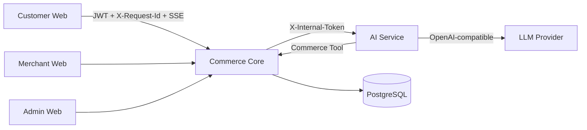
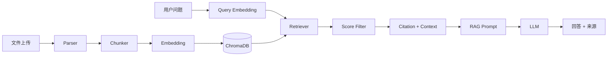

# AI 应用开发项目学习手册——南志洋

> 版本日期：2026-08-29  
> 学习周期：30 天，每天 1.5—2 小时  
> 对应项目：`D:\project\AI_Commerce_Platform`、`D:\project\knowledge_chat`

---

## 0. 这份手册怎么用

这份手册不是技术名词清单，而是一张“知识—代码—验证—表达”的学习地图。每学习一个知识点，都必须回答五个问题：

1. 它解决什么问题？
2. 它在我的项目中出现在哪里？
3. 请求经过了哪些类、函数、接口和数据结构？
4. 为什么采用当前方案，而不是另一种方案？
5. 当前实现有什么限制，如果规模扩大应如何改进？

### 0.1 三种状态

- **[已实现]**：当前代码中真实存在，可以结合源码和演示讲解。
- **[需掌握]**：项目涉及这个概念，但需要补足原理，不能只会使用。
- **[可优化]**：当前没有完整实现，只能作为改进方向，不能包装成已有能力。

### 0.2 每天固定流程

| 环节 | 时间 | 做什么 | 当天产出 |
|---|---:|---|---|
| 概念学习 | 20 分钟 | 阅读本章知识解释，整理关键词 | 5 个关键词 |
| 源码导航 | 40 分钟 | 从入口顺着调用链阅读，不随机翻文件 | 一张调用链 |
| 实践验证 | 30 分钟 | 运行、断点、改配置或增加临时测试 | 一条观察结论 |
| 口述复盘 | 20 分钟 | 不看资料回答当天面试题并录音 | 2 分钟录音 |
| 错题整理 | 10 分钟 | 记录说不清的概念 | 次日复习项 |

### 0.3 掌握程度

| 颜色 | 标准 |
|---|---|
| 🔴 红色 | 只见过名词，无法说明项目位置 |
| 🟡 黄色 | 能解释概念，但不能完整讲调用链和取舍 |
| 🟢 绿色 | 能结合代码、异常、限制和改进方向回答追问 |

### 0.4 不能写进简历或面试中主动宣称的内容

除非你有真实压测或监控报告，否则不要宣称：生产级高并发、固定 QPS、100+ 并发用户、日均千单、零宕机、线上准确率。正确说法是：

> 项目目前以本地演示和自动化验证为主，已经覆盖单元测试、AI Eval 和核心 E2E，但尚未进行生产级容量压测。

---

# 第一部分：两个项目的真实定位

## 1. AI 智能电商平台是什么

**一句话定位：**一个将 LLM 安全接入真实交易系统的 AI 全栈应用，通过自然语言搜索商品，并在用户明确确认后执行真实加购。

它不是“模型自主控制整个商城”，而是：

```text
模型负责：生成自然语言解释、基于可信上下文组织回答
规则负责：识别当前支持的搜索条件、决定写操作是否确认
工具负责：调用受保护的商品查询和购物车接口
Commerce Core 负责：身份、商品、SKU、价格、库存、订单和交易事实
用户负责：确认会改变账户状态的写操作
```

### 1.1 为什么它属于 AI 应用开发

- [已实现] OpenAI-compatible LLM 流式生成。
- [已实现] 将真实商品数据作为可信上下文交给模型。
- [已实现] 商品搜索和确认加购工具。
- [已实现] SSE 流式交互和结构化 `meta` 事件。
- [已实现] Prompt 中限制模型不得编造商品、价格、库存和评分。
- [已实现] AI Eval、模型/工具指标和异常降级。
- [可优化] 当前商品搜索意图主要由确定性规则解析，不是模型原生 Tool Calling。
- [可优化] 当前没有 LangGraph、多 Agent 和长期任务状态机。

### 1.2 工作流不等于 LangGraph

当前工作流由代码显式编排：

```text
收到请求
→ 校验 Action
→ 未确认则返回 confirmation
→ 已确认则执行 add_to_cart
→ 解析商品搜索意图
→ 调用 product_search
→ 组装可信上下文
→ 调用 Provider
→ 流式输出
→ 记录指标
```

入口：`D:\project\AI_Commerce_Platform\ai-service\app\api\chat.py`

面试表达：

> 我没有为了堆技术名词引入 LangGraph。当前流程分支固定、工具数量有限，并且包含交易写操作，所以使用服务端显式编排更容易测试、审计和控制权限。未来如果出现多轮规划、多工具循环和可恢复长任务，再考虑图工作流框架。

## 2. Knowledge Chat 是什么

**一句话定位：**一个面向企业私有知识的 RAG 平台，将上传文档解析、切片并向量化，在用户提问时检索相关上下文，生成带引用来源的回答。

### 2.1 为什么它属于 AI 应用开发

- [已实现] 文档解析、Chunk、Embedding 和 ChromaDB 存储。
- [已实现] Query Embedding、Top-K 检索和分数过滤。
- [已实现] RAG Prompt、对话历史和 LLM 调用。
- [已实现] Citation 引用构建。
- [已实现] LLM Provider、Embedding Provider 和 Prompt Provider 抽象。
- [已实现] 默认 Prompt、数据库 Prompt、Prompt 版本及缓存相关模块。
- [已实现] 用户、知识库和权限隔离。
- [可优化] 建立系统化 RAG Eval 数据集和量化指标。
- [可优化] 在确认实际启用路径后完善混合检索、Reranker 和大规模向量库方案。

## 3. 两个项目形成的能力闭环

| 项目 | 主要证明 | 面试关键词 |
|---|---|---|
| Knowledge Chat | 私有知识如何进入 LLM 上下文 | RAG、Embedding、Chunk、Vector Search、Prompt、Citation |
| AI 智能电商平台 | LLM 如何安全调用真实业务能力 | Tool、SSE、JWT、确认机制、可信数据、Eval、可观测性 |

正确的成长故事：

> 我先通过 Knowledge Chat 掌握 RAG，解决模型无法直接访问私有知识的问题；随后在 AI 电商平台中进一步解决模型如何访问真实业务数据、如何执行受限工具、如何保护用户身份和交易数据的问题。

---

# 第二部分：AI 智能电商平台吃透指南

## 4. 总体架构



### 4.1 服务职责

| 服务 | 职责 | 不应该负责 |
|---|---|---|
| Customer Web | 输入、SSE 展示、商品卡片、确认按钮 | 决定真实身份、价格和库存 |
| Commerce Core | JWT、权限、商品、库存、购物车、订单、支付、售后 | 自由生成自然语言 |
| AI Service | 意图解析、工具编排、Prompt、Provider、SSE | 绕过 Core 直接写数据库 |
| LLM Provider | 基于上下文生成回答 | 决定交易事实和用户权限 |

## 5. 商品搜索完整链路

```text
1. 用户输入“帮我找 500 到 1000 元的耳机”
2. aiClient.ts 携带 JWT、X-Request-Id 发起请求
3. Commerce Core 校验 JWT，并作为 AI Gateway 转发
4. AI Service 的 ProductSearchIntentParser 提取条件
5. CommerceTool 调用 Commerce Core 内部商品接口
6. Core 查询真实商品/SKU/价格/库存
7. AI Service 先发送 product_search meta
8. Provider 根据可信商品上下文生成回答
9. message 事件逐步输出 token
10. done 事件结束，前端停止 loading
```

### 5.1 代码导航

- 前端请求：`D:\project\AI_Commerce_Platform\frontend\customer-web\src\services\ai\aiClient.ts`
- SSE 类型：`D:\project\AI_Commerce_Platform\frontend\customer-web\src\services\ai\aiTypes.ts`
- 状态更新：`D:\project\AI_Commerce_Platform\frontend\customer-web\src\stores\aiStore.ts`
- AI 页面：`D:\project\AI_Commerce_Platform\frontend\customer-web\src\features\ai\assistant\components\ChatPanel.tsx`
- Core 网关：`D:\project\AI_Commerce_Platform\backend\commerce-platform\src\main\java\com\commerce\platform\ai\service\AiGatewayService.java`
- AI 编排：`D:\project\AI_Commerce_Platform\ai-service\app\api\chat.py`
- 意图解析：`D:\project\AI_Commerce_Platform\ai-service\app\services\product_search_intent_parser.py`
- 工具调用：`D:\project\AI_Commerce_Platform\ai-service\app\services\commerce_tool.py`

### 5.2 意图解析到底是不是 AI

当前解析器主要使用关键词、同义词和正则表达式提取价格区间。这是确定性 NLP/规则解析，不应描述为“模型自动规划”。

优点：稳定、便宜、容易测试、不会因模型随机性破坏 CI。  
限制：理解复杂语义、否定、组合条件和上下文指代的能力有限。

面试回答：

> 当前采用规则解析作为交易入口的稳定基线，真实 LLM 用于基于可信数据生成自然语言回答。如果继续增强，我会增加结构化 LLM 意图提取，但输出必须经过 Pydantic 和业务规则校验，并保留规则解析作为降级路径。

## 6. 确认加购完整链路

```text
商品卡片点击“加入购物车”
→ 请求 action=add_to_cart, confirmed=false
→ Action Policy 返回 confirm
→ SSE meta: add_to_cart_confirmation
→ 用户点击“确认加入购物车”
→ 请求 confirmed=true
→ Action Policy 返回 execute
→ Commerce Tool 调用内部加购接口
→ Commerce Core 从 JWT Principal 获取用户 ID
→ 回查 SKU、商品、价格、库存和可售状态
→ 写入购物车
→ SSE meta: add_to_cart_result
```

关键文件：

- `D:\project\AI_Commerce_Platform\ai-service\app\services\action_policy.py`
- `D:\project\AI_Commerce_Platform\frontend\customer-web\src\features\ai\assistant\components\MessageBubble.tsx`
- `D:\project\AI_Commerce_Platform\backend\commerce-platform\src\main\java\com\commerce\platform\cart\service\CartApplicationService.java`

### 6.1 为什么不能信任请求体中的 userId

JWT 验证后的 Principal 才是认证身份。请求体、前端状态和模型输出都属于不可信输入。攻击者可以在浏览器开发者工具中修改 JSON，因此 Core 必须覆盖或忽略外部 `userId`。

标准回答：

> AI Service 和前端可以传递业务意图，但不能声明自己是谁。Commerce Core 只从 JWT Principal 读取真实用户身份，因此伪造 userId 不能越权操作其他用户购物车。

### 6.2 为什么加购也要确认

加购虽然不是付款，但会改变用户账户状态，且可能影响后续结算。确认机制可以证明你理解“模型建议”和“业务写操作”之间的边界。

## 7. SSE 流式协议

### 7.1 四类事件

| 事件 | 作用 | 示例 |
|---|---|---|
| `message` | 文本 token | `{"type":"token","content":"你"}` |
| `meta` | 商品、确认、工具结果 | `product_search`、`add_to_cart_result` |
| `error` | 可公开错误 | Provider 或工具错误 |
| `done` | 请求正常结束 | conversation/message ID |

### 7.2 为什么一次网络读取不等于一个事件

TCP/HTTP 流只保证字节顺序，不保证业务消息边界。一个 JSON 可能拆成多次读取，多个事件也可能一次到达。因此前端必须：

```text
新数据追加到 buffer
→ 按空行分割完整 SSE frame
→ 解析完整 frame
→ 剩余半帧保留到下次读取
```

对应测试：`D:\project\AI_Commerce_Platform\frontend\customer-web\src\services\ai\aiClient.test.ts`

### 7.3 SSE 与 WebSocket

| 维度 | SSE | WebSocket |
|---|---|---|
| 方向 | 服务端到客户端 | 双向 |
| 协议 | HTTP | WebSocket |
| AI Token 输出 | 很适合 | 可以但偏重 |
| 浏览器重连 | 原生 EventSource 支持；fetch 流需自己处理 | 自己处理 |
| 当前项目 | 适合单次请求持续输出 | 没必要引入双向通道 |

## 8. Prompt 与 Provider

### 8.1 AI 电商的 Prompt 在哪里

`D:\project\AI_Commerce_Platform\ai-service\app\services\openai_compatible_llm_provider.py`

System Prompt 的核心约束：

- 只能基于可信商品数据回答。
- 无结果时明确告知并建议放宽条件。
- 不编造商品、价格、库存和评分。
- 加购成功时明确反馈。

### 8.2 Mock 与真实 Provider

| Provider | 是否调用外部模型 | 用途 |
|---|---|---|
| Mock | 否 | 本地无 Key 演示、CI、确定性 E2E |
| OpenAI-compatible | 是 | DeepSeek 或兼容 Chat Completions 接口 |

不要说“Mock Provider 测试了模型准确率”。它测试的是应用协议、编排和页面流程。

### 8.3 当前 Prompt 的限制

- [已实现] 固定 System Prompt 和可信上下文注入。
- [可优化] 从 Provider 中拆分独立 Prompt 模块。
- [可优化] 增加 Prompt 版本、测试用例和回滚。
- [可优化] 对上下文做字段白名单和更严格格式化。

## 9. Commerce Core：交易真相源

模型不拥有以下事实的最终解释权：用户身份、商品名称、SKU、价格、库存、订单状态、支付状态、退款状态。

### 9.1 SPU 与 SKU

- SPU：一种标准商品，例如“星云降噪蓝牙耳机”。
- SKU：具体可售规格，例如“黑色 + 256GB”或“黑色耳机”。
- 价格和库存通常落在 SKU，而不是只落在 SPU。

### 9.2 库存为什么需要预留

直接下单后立刻永久扣减，支付失败时难以恢复；完全不锁库存又会超卖。常见流程：

```text
创建订单 → 预留库存 → 支付成功后确认扣减
                    → 超时/取消后释放预留
```

项目导航：`D:\project\AI_Commerce_Platform\backend\commerce-platform\src\main\java\com\commerce\platform\inventory`

### 9.3 支付回调为什么要幂等

支付平台可能重试通知，同一个支付成功事件可能到达多次。服务端必须通过业务单号、支付单状态或唯一约束保证重复回调不会重复扣库存、重复记账或重复触发履约。

### 9.4 退款与退货

退款是资金流程，退货是商品逆向履约流程。退货批准不应直接等同于退款完成，通常要经历申请、批准、寄回、收货、退款等状态。

项目导航：

- `D:\project\AI_Commerce_Platform\backend\commerce-platform\src\main\java\com\commerce\platform\refund`
- `D:\project\AI_Commerce_Platform\backend\commerce-platform\src\main\java\com\commerce\platform\returns`
- `D:\project\AI_Commerce_Platform\backend\commerce-platform\src\main\java\com\commerce\platform\payment`
- `D:\project\AI_Commerce_Platform\backend\commerce-platform\src\main\java\com\commerce\platform\order`

## 10. JWT 与服务间认证

### 10.1 JWT 三部分

```text
Header.Payload.Signature
```

Payload 只是 Base64URL 编码，不是加密，不能放密码、API Key 等敏感信息。Signature 用来验证内容是否被篡改。

### 10.2 三端隔离

Customer、Merchant、Admin 具有不同客户端身份和权限。即使 Token 格式相似，后端也要校验角色和 Client Type。

代码导航：

- `D:\project\AI_Commerce_Platform\backend\commerce-platform\src\main\java\com\commerce\platform\common\security\JwtUtil.java`
- `D:\project\AI_Commerce_Platform\backend\commerce-platform\src\main\java\com\commerce\platform\common\security\JwtAuthenticationFilter.java`
- `D:\project\AI_Commerce_Platform\backend\commerce-platform\src\main\java\com\commerce\platform\common\security\InternalTokenAuthenticationFilter.java`
- `D:\project\AI_Commerce_Platform\backend\commerce-platform\src\main\java\com\commerce\platform\common\config\SecurityConfig.java`

### 10.3 内部令牌与 JWT 的区别

JWT 代表最终用户；内部令牌证明调用方是受信任服务。AI Service 调用 Core 的内部工具接口时需要内部认证，但最终用户身份仍应由 Core 网关从已验证 JWT 绑定，不能由模型自由声明。

## 11. 可观测性与 AI Eval

### 11.1 X-Request-Id

同一个请求在浏览器、Commerce Core、AI Service 和 Commerce Tool 中使用同一个 ID，便于关联日志。

入口：`D:\project\AI_Commerce_Platform\backend\commerce-platform\src\main\java\com\commerce\platform\common\web\RequestIdFilter.java`

### 11.2 TTFT 与总耗时

- TTFT：从请求开始到第一个 token 到达的时间。
- 总耗时：从请求开始到完成或失败的时间。
- P95：95% 请求的指标不超过该值，比平均值更能暴露慢请求。

当前指标是单实例内存统计，不等于生产监控平台。

### 11.3 AI Eval 实际测什么

位置：`D:\project\AI_Commerce_Platform\ai-service\evals`

- 搜索意图是否识别。
- 关键词、价格、排序、分页字段是否匹配。
- 普通聊天是否误触发商品工具。
- 未确认加购是否不会执行。
- 非法数量、SKU 和故障映射是否正确。

它主要评估确定性解析与安全策略，不等同于全面评估真实模型回答质量。

## 12. Docker 与 CI

`docker compose up --build` 的含义：构建镜像、创建网络和卷、按健康检查启动 PostgreSQL、Commerce Core、AI Service 和三端前端。

CI 流程：

```text
Java Maven Test
+ 三端前端 Lint/Build
+ Customer Vitest
+ Python Pytest
+ AI Eval
+ Docker Compose
+ Playwright E2E
```

入口：`D:\project\AI_Commerce_Platform\.github\workflows\ci.yml`

### AI 电商自测

- [ ] 能画出浏览器到工具再回到浏览器的链路。
- [ ] 能解释为什么模型不能决定价格和身份。
- [ ] 能解释 confirmed=false 与 true 的差异。
- [ ] 能解释 SSE 半包处理。
- [ ] 能说清 Mock、真实 Provider 和 Prompt。
- [ ] 能区分 AI Eval、单元测试和 E2E。
- [ ] 能诚实说明规则解析和内存指标的限制。

---

# 第三部分：Knowledge Chat 吃透指南

## 13. RAG 总体架构



## 14. 文档写入链路

```text
上传文件
→ 校验用户与知识库权限
→ 保存文件和数据库记录
→ ParserFactory 选择解析器
→ 提取纯文本
→ Chunker 切分文本
→ Embedding Provider 批量向量化
→ Vector Store 写入向量、文本和 metadata
→ 更新文档处理状态
```

### 14.1 代码导航

- 上传 API：`D:\project\knowledge_chat\backend\app\api\documents.py`
- 文件解析：`D:\project\knowledge_chat\backend\app\services\parser`
- 旧工具入口：`D:\project\knowledge_chat\backend\app\utils\file_parser.py`
- Chunk：`D:\project\knowledge_chat\backend\app\services\chunking`
- Embedding：`D:\project\knowledge_chat\backend\app\services\embedding_service.py`
- Provider：`D:\project\knowledge_chat\backend\app\services\embedding`
- 文档任务：`D:\project\knowledge_chat\backend\app\services\tasks\document_task.py`
- 向量存储：`D:\project\knowledge_chat\backend\app\storage\vector_store.py`

### 14.2 为什么要解析文件

LLM 和向量模型需要文本输入。PDF、DOCX、Markdown 和 TXT 的存储格式不同，因此先由 Parser 转成统一文本，再进入后续 Pipeline。

### 14.3 Chunk size 与 overlap

- Chunk 太小：上下文不完整，单个片段可能失去语义。
- Chunk 太大：包含无关信息，Embedding 表达被稀释，并消耗更多上下文窗口。
- Overlap：让相邻 Chunk 共享部分文字，避免答案跨边界时被割裂。

没有通用最佳值。应通过目标文档和问题集做评测，而不是只凭经验设置。

### 14.4 Embedding 是什么

Embedding 将文本映射到高维向量，使语义相近的文本在向量空间中更接近。它不是加密，也不是模型生成答案。

需掌握：

- 文档和问题必须使用兼容的 Embedding 模型。
- 向量维度必须一致。
- 更换模型后通常需要重建历史向量。
- 相似度高只表示语义接近，不保证内容一定正确。

### 14.5 ChromaDB 中保存什么

通常包含：

- id：`documentId_chunkIndex`
- embedding：Chunk 向量
- document：Chunk 原文
- metadata：document_id、filename、chunk_index、knowledge_base_id、user_id 等

关系数据库保存业务实体和状态，向量库负责语义检索，两者职责不同。

### 14.6 删除文档的生命周期

正确流程要同时处理：数据库记录、上传文件、向量 Chunk。若只删数据库，向量仍可能被召回；若只删向量，管理页面仍显示文档。

## 15. RAG 查询链路

```text
用户问题
→ 验证用户拥有知识库访问权
→ Query Embedding
→ Retriever 在指定 KB 中检索 Top-K
→ min_score 过滤
→ CitationBuilder 构造引用
→ 拼接 context
→ Prompt Provider 构造 RAG System Prompt
→ 加入历史消息和当前问题
→ LLM Provider 生成回答
→ 返回答案与 sources
```

### 15.1 核心文件

- `D:\project\knowledge_chat\backend\app\services\chat_service.py`
- `D:\project\knowledge_chat\backend\app\services\retrieval_pipeline.py`
- `D:\project\knowledge_chat\backend\app\services\retrieval\vector_retriever.py`
- `D:\project\knowledge_chat\backend\app\services\citation\builder.py`
- `D:\project\knowledge_chat\backend\app\api\knowledge_query.py`

### 15.2 Top-K 与 min_score

Top-K 控制最多取回多少片段；min_score 过滤相似度过低的内容。

- K 太小：可能漏掉关键上下文。
- K 太大：噪声增加、Prompt 变长、费用和延迟上升。
- 阈值太高：经常无结果。
- 阈值太低：无关文本进入上下文，增加幻觉风险。

### 15.3 Citation 为什么重要

引用来源让用户可以验证回答，降低“模型说了就信”的风险。Citation 不保证答案一定正确，但提供可追溯依据。

### 15.4 没有检索结果怎么办

推荐策略：明确告知知识库中没有足够依据，不要把模型通用知识伪装成文档答案。可以建议用户换个问法、上传资料或切换普通聊天模式。

## 16. Prompt Provider

目录：`D:\project\knowledge_chat\backend\app\prompts`

| 模块 | 作用 |
|---|---|
| `base.py` | 定义 System Prompt 和 RAG Prompt 接口 |
| `default.py` | 默认模板 |
| `database.py` | 从数据库解析模板，失败时回退默认模板 |
| `resolver.py` | 选择当前 Provider |
| `prompt_cache.py` | Prompt 缓存与并发保护 |

ChatService 会将检索 context 和 question 交给 Prompt Provider，再构造模型消息。

面试回答：

> 我没有把 Prompt 字符串散落在业务服务里，而是抽象为 Prompt Provider。默认模板提供稳定回退，数据库模板支持运营配置和版本管理，ChatService 只依赖统一接口。

## 17. 多 Provider 设计

### 17.1 为什么抽象 LLM Provider

业务层只关心 `chat(messages, stream)`，不应该依赖某一家厂商的 SDK。Factory 根据配置创建 DeepSeek、Agens 或其他实现。

路径：`D:\project\knowledge_chat\backend\app\services\llm`

### 17.2 为什么 Embedding Provider 也要抽象

不同 Provider 的模型、维度、批量限制、鉴权方式不同。抽象后可以替换模型，但更换维度时要考虑向量重建。

路径：`D:\project\knowledge_chat\backend\app\services\embedding`

## 18. 用户隔离与权限

业务查询必须同时包含资源 ID 和所有者/授权条件，而不是先按 ID 查出再相信前端。

示例思想：

```text
SELECT knowledge_base
WHERE id = :kb_id
AND user_id = :current_user_id
```

导航：

- `D:\project\knowledge_chat\backend\app\auth\deps.py`
- `D:\project\knowledge_chat\backend\app\core\rbac.py`
- `D:\project\knowledge_chat\backend\app\models\knowledge_acl.py`
- `D:\project\knowledge_chat\backend\app\api\knowledge_config.py`

向量检索同样必须按 `knowledge_base_id` 过滤，否则会发生跨知识库召回。

## 19. RAG 的限制与扩展

- [需掌握] RAG 不是绝对消除幻觉，只是提供更可靠上下文。
- [需掌握] 检索质量通常比 Prompt 花哨程度更重要。
- [可优化] 建立问题—期望文档—期望答案评测集。
- [可优化] 对复杂查询做 Query Rewrite。
- [可优化] 验证 BM25、向量混合检索和 Reranker 是否真正接入主链路。
- [可优化] 数据量扩大后迁移 Qdrant、Milvus、pgvector 或托管向量服务。
- [可优化] 增加文档版本和增量重建策略。

### Knowledge Chat 自测

- [ ] 能解释文档写入与查询是两条不同 Pipeline。
- [ ] 能解释 Chunk、Overlap、Embedding、Top-K 和阈值。
- [ ] 能指出 Prompt Provider 和 Retrieval Pipeline 的代码位置。
- [ ] 能解释关系数据库与向量数据库的职责。
- [ ] 能解释用户隔离为什么要同时作用于 SQL 和向量检索。
- [ ] 能诚实说明 RAG 评测与大规模检索仍可加强。

---

# 第四部分：共用基础知识

## 20. Spring Boot 分层

```text
Filter → Controller → 参数校验 → Service/Application → Domain → Repository → Database
```

- Controller：协议适配，不堆复杂业务。
- Service/Application：用例编排和事务边界。
- Domain：状态和核心规则。
- Repository：隐藏持久化细节。

### IoC 与依赖注入

IoC 表示对象创建和依赖关系由容器管理；依赖注入是实现 IoC 的方式。好处是解耦实现、便于测试和替换。

### Filter、Interceptor、AOP

| 机制 | 层级 | 适用场景 |
|---|---|---|
| Filter | Servlet 容器 | JWT、CORS、Request ID |
| Interceptor | Spring MVC | Controller 前后处理、用户上下文 |
| AOP | 方法调用 | 日志、权限注解、审计、事务 |

## 21. 事务与数据库

### ACID

- 原子性：全部成功或全部失败。
- 一致性：业务约束在事务前后成立。
- 隔离性：并发事务互相影响受到控制。
- 持久性：提交后的结果不会因普通故障丢失。

### 隔离问题

- 脏读：读到未提交数据。
- 不可重复读：同一事务两次读取同一行结果不同。
- 幻读：同一条件两次查询行数不同。

### 索引

索引提升读取但增加写成本和存储；联合索引要关注最左前缀；低区分度字段单独建索引可能收益有限。

## 22. Redis

Cache Aside：

```text
读：查缓存 → miss → 查数据库 → 回填缓存
写：更新数据库 → 删除缓存
```

- 穿透：查询不存在数据；可用空值缓存、布隆过滤器。
- 击穿：热点 Key 失效；可用互斥重建、逻辑过期。
- 雪崩：大量 Key 同时失效；可加随机过期、限流和降级。

交易事实仍以数据库为准，不能因为 Redis 快就让它成为订单和支付唯一数据源。

## 23. FastAPI 与异步

- Pydantic：请求/响应结构和校验。
- Depends：依赖注入、认证和共享逻辑。
- async/await：等待网络、数据库、模型流时释放事件循环。
- StreamingResponse：持续输出异步迭代器。

异步不等于自动变快；CPU 密集任务会阻塞事件循环，应放到线程池、进程池或任务队列。

## 24. Prompt、Tool 与工作流

- Prompt：向模型描述角色、规则、输入和输出要求。
- Context：当前请求可用的可信信息。
- Structured Output：要求模型按 JSON/Schema 输出。
- Tool：模型或编排层可调用的外部能力。
- Workflow：多个步骤、条件分支、状态和失败处理的组合。
- Agent：通常包含动态规划、工具选择和循环，不是有聊天框就叫 Agent。

## 25. 测试层级

| 类型 | 验证什么 | 两个项目中的例子 |
|---|---|---|
| 单元测试 | 单个函数/类 | Intent Parser、Action Policy、Parser |
| 集成测试 | 模块协作 | Controller + Service + DB/Mock |
| E2E | 用户可见流程 | 登录、AI 搜索、确认加购 |
| AI Eval | AI/策略任务指标 | 意图、字段、安全策略、检索质量 |

---

# 第五部分：30 天学习计划

> 每天完成后必须写一句“今天我能够解释……”并录制 2 分钟口述。

| 天数 | 学习目标 | 源码入口 | 实践任务 | 口述题 | 验收标准 |
|---:|---|---|---|---|---|
| 1 | 两个项目定位 | 两个 README | 手画两张架构图 | 两个项目分别解决什么问题？ | 3 分钟不看稿 |
| 2 | AI 电商搜索链路 | `aiClient.ts`、`chat.py` | 顺着请求记录 10 个节点 | 请求如何往返？ | 能指到文件 |
| 3 | Knowledge Chat 两条 Pipeline | `documents.py`、`chat_service.py` | 分别画写入/查询链路 | 为什么分成两条？ | 无遗漏核心步骤 |
| 4 | Spring 分层和 IoC | Core Controller/Service/Repository | 选一个接口画分层 | 为什么不把业务写 Controller？ | 能解释注入与测试 |
| 5 | JWT 认证 | `JwtAuthenticationFilter`、`JwtUtil` | 查看 Token claims | JWT 为什么不能放密码？ | 能讲三部分和签名 |
| 6 | 权限与身份绑定 | AI Gateway、内部接口 | 构造伪造 userId 思路 | 为什么只信 Principal？ | 能解释越权防护 |
| 7 | 订单状态 | order 模块 | 画订单状态图 | 状态能否任意跳转？ | 能讲合法转换 |
| 8 | 库存与事务 | inventory 模块 | 画预留/扣减/释放 | 如何避免超卖？ | 能讲事务与并发 |
| 9 | 支付、退款、退货 | payment/refund/returns | 画支付回调和售后链路 | 为什么回调要幂等？ | 能区分退款与退货 |
| 10 | SSE 协议 | `aiClient.ts` | 手工拆分半个 JSON | 为什么一次 read 不是一条消息？ | 能讲 buffer |
| 11 | 前端 AI 状态 | `aiStore.ts`、`MessageBubble.tsx` | 跟踪 confirmation 到 result | loading 如何结束？ | 能讲异常状态 |
| 12 | Prompt 与 Provider | 两个 Provider | 对比 Mock/真实调用 | Mock 测试了什么？ | 不夸大模型能力 |
| 13 | Commerce Tool 与确认 | `action_policy.py`、`commerce_tool.py` | 跟踪 false/true 两次请求 | 为什么要二次确认？ | 能讲安全边界 |
| 14 | 指标、Eval、CI | `usage_tracker.py`、`evals`、CI | 阅读一条失败用例 | AI Eval 与 E2E 区别？ | 能解释四类测试 |
| 15 | 文件上传与 Parser | `documents.py`、parser | 上传不同格式文件 | 为什么先转纯文本？ | 能讲 Parser Factory |
| 16 | Chunk | chunking 模块 | 比较两个 chunk size | 太大太小的影响？ | 能解释 overlap |
| 17 | 文档生命周期 | task、vector_store | 跟踪新增和删除 | 为什么要双端删除？ | 能讲一致性风险 |
| 18 | Embedding | embedding 模块 | 记录模型和维度 | Embedding 是什么？ | 不说成加密/答案 |
| 19 | ChromaDB | `vector_store.py` | 查看 metadata | 向量库保存什么？ | 能讲 SQL/向量职责 |
| 20 | 用户隔离 | auth、KB API | 跟踪 current_user 条件 | 如何防跨库检索？ | 能讲双重过滤 |
| 21 | Retrieval Pipeline | `retrieval_pipeline.py` | 逐行画数据变化 | Pipeline 每步输入输出？ | 能解释结果对象 |
| 22 | Top-K 与阈值 | Runtime Config、Retriever | 调整参数观察结果 | K 越大越好吗？ | 能讲召回与噪声 |
| 23 | Citation 与 RAG Prompt | citation、prompts | 查看最终消息结构 | Citation 有何价值？ | 能讲可追溯性 |
| 24 | 多 Provider | llm/embedding factory | 对比 Provider 接口 | 为什么用 Factory？ | 能讲解耦与迁移 |
| 25 | 异常、缓存、降级 | prompt cache、exception | 列 6 种失败 | 无检索结果怎么办？ | 能给固定策略 |
| 26 | AI 电商综合实验 | 全链路 | 完成实验 1—6 | 5 分钟介绍电商 | 演示无卡顿 |
| 27 | RAG 综合实验 | 全链路 | 完成实验 7—12 | 5 分钟介绍 RAG | 能解释参数变化 |
| 28 | 系统设计 | 本手册设计题 | 画 AI 导购/RAG 方案 | 如何控制模型权限？ | 结构化回答 10 分钟 |
| 29 | 模拟面试 | 题库 | 随机抽 20 题录音 | 项目最难点是什么？ | 80% 独立回答 |
| 30 | 最终验收 | README、演示脚本 | 完成 5 分钟演示 | 如果重做如何改？ | 绿灯项达到 80% |

---

# 第六部分：12 个动手实验

## 实验 1：跟踪商品搜索

步骤：登录 Customer，打开浏览器 Network，发送“帮我找 500 到 1000 元的耳机”，记录 Request ID、请求体、SSE 事件顺序和商品数据。  
预期：先看到结构化商品 `meta`，随后看到文本 `message`，最后 `done`。  
复盘：商品卡片为什么不能只从模型文本解析？

## 实验 2：跟踪确认加购

分别记录 `confirmed=false` 和 `confirmed=true`。  
预期：第一次只返回确认，不写购物车；第二次执行工具并返回结果。  
复盘：如果用户连续点击两次确认，是否还需要接口幂等？

## 实验 3：伪造 userId

仅在本地测试环境修改请求体中的 userId，比较 JWT 用户和请求体用户。  
预期：真实操作仍绑定认证用户或被拒绝。  
复盘：内部 Token 为什么不能替代最终用户身份？

## 实验 4：SSE 半帧

阅读 `aiClient.test.ts` 中拆分 JSON 的用例，手工写出 buffer 每一步内容。  
预期：只有出现完整空行分隔后才解析。  
复盘：网络层为什么没有业务消息边界？

## 实验 5：切换 Provider

比较 Mock 和 OpenAI-compatible 配置与日志。真实 Provider 需要你自己的合法 Key，不要把 Key 写入仓库。  
复盘：为什么 CI 不应该依赖真实模型？

## 实验 6：增加 Eval 用例

临时新增一个同义词搜索和一个非法加购用例，运行 Eval 后恢复代码。  
复盘：任务级指标和文本主观评价有什么区别？

## 实验 7：上传文档并跟踪处理

上传 TXT/PDF/DOCX，记录 Parser、Chunk 数量、Embedding 调用和 Chroma metadata。  
复盘：解析成功是否意味着检索一定成功？

## 实验 8：调整 Chunk 参数

选择同一篇文档，用两组 chunk size/overlap 处理，使用相同问题比较来源。  
复盘：为什么不能只追求更大的 Chunk？

## 实验 9：调整 Top-K 与阈值

分别使用低 K、高 K、低阈值和高阈值，记录召回数量与噪声。  
复盘：召回率和精确率如何权衡？

## 实验 10：检索无结果

询问文档中完全不存在的问题。  
预期：系统应说明缺少依据，而不是冒充文档答案。  
复盘：普通聊天模式和 RAG 模式的产品边界是什么？

## 实验 11：Prompt Injection

在文档中加入“忽略此前规则”等文本，观察它是否被当作普通资料。不要在真实环境执行危险操作。  
复盘：检索文档为什么也是不可信输入？

## 实验 12：删除文档

删除后检查数据库、上传文件和向量检索结果。  
复盘：跨存储一致性失败时如何补偿？

---

# 第七部分：60 道核心面试题

> 使用方法：先遮住答案口述，再查看。每题至少准备“30 秒回答”和“结合项目回答”。

## A. AI 电商架构与安全（1—12）

### 1. 为什么浏览器不直接调用 AI Service？
**考察：**安全边界。  
**短答：**模型 Key、内部工具和服务令牌不能暴露给浏览器，统一经过 Commerce Core 做 JWT、权限和审计。  
**追问：**这样是否增加延迟？会，但换来统一认证、业务校验和可观测性。

### 2. Commerce Core 和 AI Service 为什么拆开？
**短答：**Core 管理确定性交易事实，AI Service 管理模型、Prompt 和流式编排，两者发布节奏和故障模式不同。  
**避坑：**不要说“拆开一定性能更高”。

### 3. 商品搜索意图如何识别？
**短答：**当前使用确定性解析器提取关键词、价格、排序和分页；复杂语义可增加 LLM 结构化解析，但仍需规则校验。  
**追问：**为什么不全部交给模型？稳定性、成本和可测试性。

### 4. AI 如何调用商品工具？
**短答：**编排层根据意图调用 CommerceTool，Tool 通过受保护内部接口访问 Core，结果作为可信上下文返回。  
**避坑：**当前不是模型原生自由 Tool Calling。

### 5. 模型能不能直接加购？
**短答：**不能。写操作必须经过结构化 Action、参数校验和用户确认，最终由 Core 执行。  
**追问：**为什么加购也算敏感写操作？会改变用户状态并影响结算。

### 6. 商品价格由谁决定？
**短答：**Commerce Core 根据 SKU 和数据库决定，模型只负责解释。  
**避坑：**不能使用模型输出价格作为结算价格。

### 7. 如何防止伪造 userId？
**短答：**Core 从 JWT Principal 读取身份，忽略或覆盖请求体身份。  
**追问：**内部服务调用如何保留用户上下文？由已认证网关安全绑定。

### 8. 为什么需要内部 Token？
**短答：**它验证调用方是受信任服务，防止外部用户直接访问内部工具接口。  
**避坑：**内部 Token 不代表最终用户。

### 9. 为什么需要二次确认？
**短答：**降低模型误解意图后执行写操作的风险，实现 Human-in-the-loop。  
**追问：**支付是否也能开放？不建议，仅可引导用户进入确定性支付流程。

### 10. 模型失败怎么办？
**短答：**转换为固定公开错误事件，结束 loading，记录错误类型和耗时，不暴露上游响应或密钥。  
**追问：**能否降级到 Mock？生产环境不应悄悄伪装成真实模型回答，应明确提示。

### 11. 工具失败怎么办？
**短答：**捕获 ToolError，返回结构化失败 `meta` 或公开错误，交易系统保持不变。  
**避坑：**不要把内部堆栈返回浏览器。

### 12. 为什么不用 LangGraph？
**短答：**当前步骤固定、工具有限且包含交易写操作，显式代码编排更易审计和测试；复杂循环规划出现后再引入。

## B. SSE、Prompt 与 Provider（13—20）

### 13. SSE 和普通 JSON 有什么区别？
**短答：**JSON 一次返回完整响应；SSE 在同一 HTTP 响应中持续发送事件，适合 token 流。

### 14. SSE 和 WebSocket 如何选择？
**短答：**单向模型输出优先 SSE；高频双向通信再考虑 WebSocket。

### 15. 为什么要维护 buffer？
**短答：**网络读取边界不等于事件边界，半个 JSON 要保留到下一块数据。

### 16. `meta` 和 `message` 为什么分开？
**短答：**商品和工具结果是结构化业务数据，不应从不稳定自然语言中反解析。

### 17. Prompt 在电商项目哪里？
**短答：**OpenAI-compatible Provider 构造 System Prompt，要求基于可信上下文且不得编造交易数据。

### 18. Mock Provider 有什么价值？
**短答：**无 Key 演示、确定性测试、避免 CI 受网络和模型随机性影响。

### 19. OpenAI-compatible 是什么意思？
**短答：**使用兼容 Chat Completions 请求与 SSE 响应格式的模型服务，不代表只能使用 OpenAI 官方模型。

### 20. Temperature 如何影响回答？
**短答：**温度越高通常随机性越强；交易辅助场景应偏低，并由业务数据约束事实。

## C. RAG 与 Knowledge Chat（21—36）

### 21. 为什么需要 RAG？
**短答：**让模型在回答时获得最新或私有资料，无需把全部知识训练进模型。

### 22. RAG 和微调有什么区别？
**短答：**RAG 动态注入知识，易更新和引用；微调主要改变行为或风格，知识更新成本高。

### 23. Embedding 是什么？
**短答：**将文本映射为高维向量，用距离表示语义相似性。

### 24. 为什么文档和问题要用兼容模型？
**短答：**两者必须处于同一向量空间，维度和语义分布不一致就无法正确比较。

### 25. 为什么切片？
**短答：**整篇文档过长且主题混杂，切片让检索定位到更具体的语义单元。

### 26. Chunk 太大有什么问题？
**短答：**噪声多、检索不精确、上下文成本高。

### 27. Chunk 太小有什么问题？
**短答：**语义和上下文不完整，答案可能跨多个片段。

### 28. overlap 有什么作用？
**短答：**保留跨 Chunk 边界的信息，但过大会产生重复和存储成本。

### 29. Top-K 越大越好吗？
**短答：**不是。K 大提高召回机会，也增加噪声、延迟和 Prompt 长度。

### 30. min_score 有什么作用？
**短答：**过滤相关性不足的片段，阈值要通过评测调优。

### 31. 如何避免无关检索？
**短答：**合理 Chunk、metadata 过滤、阈值、Query Rewrite、混合检索、Reranker 和评测集。

### 32. 没有检索结果怎么办？
**短答：**明确缺少知识库依据，不把模型通用知识冒充文档答案。

### 33. Citation 有什么价值？
**短答：**让用户验证答案来源，提供可追溯性和问题排查入口。

### 34. 如何做用户数据隔离？
**短答：**SQL 查询校验所有权/ACL，向量检索同时按 knowledge_base_id 等 metadata 过滤。

### 35. ChromaDB 适合什么场景？
**短答：**本地开发、中小规模原型和单机持久化；大规模分布式场景需评估专业向量数据库。

### 36. RAG 能完全消除幻觉吗？
**短答：**不能。它改善依据，但仍受检索错误、Prompt、模型推理和来源质量影响。

## D. Prompt、工作流与 Provider（37—43）

### 37. System Prompt 和 User Prompt 区别？
**短答：**System 定义角色和全局规则，User 表达当前请求；系统规则通常优先但不能替代后端安全校验。

### 38. 为什么 Prompt 要独立管理？
**短答：**便于版本、测试、回滚、运营配置和避免业务代码散落字符串。

### 39. 文档中的指令为什么不可信？
**短答：**检索资料属于外部输入，可能包含 Prompt Injection，不能拥有系统指令权限。

### 40. 什么是结构化输出？
**短答：**让模型按 JSON Schema 等格式输出，方便程序消费；仍需解析和校验。

### 41. Tool Calling 和普通聊天区别？
**短答：**Tool Calling 将意图转为结构化工具参数并访问外部系统，普通聊天只生成文本。

### 42. 什么情况下需要 LangGraph？
**短答：**多步骤动态分支、循环工具调用、持久状态、人工审批和可恢复长任务。

### 43. Provider Factory 有什么价值？
**短答：**业务依赖统一接口，配置决定具体模型实现，降低厂商耦合并方便测试。

## E. Java、JWT、Redis、数据库（44—53）

### 44. IoC 和 DI 是什么？
**短答：**对象创建控制权交给容器，容器通过构造器等方式注入依赖，提高解耦和可测试性。

### 45. Controller 为什么不写复杂业务？
**短答：**Controller 应处理 HTTP 适配，业务规则进入 Service/Domain，便于复用、事务和测试。

### 46. Filter、Interceptor、AOP 区别？
**短答：**Filter 位于 Servlet 层，Interceptor 位于 MVC，AOP 拦截 Spring 方法调用。

### 47. JWT 为什么不能存敏感数据？
**短答：**Payload 通常只是编码，客户端可读；签名防篡改但不保密。

### 48. JWT 被盗怎么办？
**短答：**短有效期、HTTPS、安全存储、刷新 Token 轮换、黑名单/会话撤销和异常检测。

### 49. 什么是事务原子性？
**短答：**同一业务操作中的数据库修改要么全部提交，要么全部回滚。

### 50. 如何避免库存超卖？
**短答：**条件更新/锁、版本号、预留机制、事务和幂等；具体取决于吞吐与一致性要求。

### 51. 为什么支付回调要幂等？
**短答：**支付平台会重试通知，重复处理可能导致重复记账或履约。

### 52. Redis Cache Aside 怎么做？
**短答：**读 miss 后查库回填；写先更新数据库再删除缓存，并处理并发一致性窗口。

### 53. 缓存穿透、击穿、雪崩区别？
**短答：**不存在数据反复查库、热点 Key 失效并发查库、大量 Key 同时失效。

## F. Docker、测试与项目反思（54—60）

### 54. Docker Compose 解决什么问题？
**短答：**统一定义多服务、网络、卷、环境变量、依赖和健康检查，实现可重复启动。

### 55. 健康检查有什么用？
**短答：**进程启动不等于服务可用，依赖方应等待数据库迁移和接口真正就绪。

### 56. 单元测试与 E2E 区别？
**短答：**单元测试定位快、范围小；E2E 从用户视角验证完整系统但更慢、更脆弱。

### 57. AI Eval 与普通测试区别？
**短答：**AI Eval 面向任务质量和安全指标，普通测试更关注确定输入输出和程序行为。

### 58. 你的项目最大不足是什么？
**短答：**AI 电商意图解析以规则为主、指标是单实例内存统计；Knowledge Chat 仍需系统化 RAG Eval 和规模化检索验证。

### 59. 如果重做 AI 电商会改什么？
**短答：**抽离 Prompt 版本、增加受校验的 LLM 结构化意图解析、持久化指标，并补充写操作幂等和真实模型离线评测。

### 60. 如果重做 Knowledge Chat 会改什么？
**短答：**先建立评测集，再基于数据调整 Chunk、检索和 Prompt；完善混合检索、Reranker、文档版本和向量重建流程。

---

# 第八部分：项目表达模板

## 26. AI 智能电商平台

### 一句话

> 一个将 LLM 安全接入真实交易系统的 AI 全栈电商平台，实现自然语言商品搜索、真实商品展示和用户确认后的受限加购。

### 1 分钟版本

> 项目包含 Customer、Merchant、Admin 三端，Spring Boot Commerce Core 负责商品、库存、购物车、订单和售后，FastAPI AI Service 负责意图解析、SSE 流式回答和受限工具编排。用户可以用自然语言搜索商品，AI Service 调用 Core 获取真实商品，再让模型基于可信上下文回答。加购属于写操作，必须经过用户二次确认，最终身份、价格和库存都由 Core 根据 JWT 和数据库重新校验。项目还使用 Mock Provider、AI Eval、Playwright 和 Docker Compose 保证可演示和可验证。

### 3 分钟结构

1. 背景：普通电商搜索难以理解自然语言，但模型不能直接控制交易。
2. 架构：三端 → Commerce Core → AI Service → Provider/Commerce Tool。
3. 搜索：规则提取条件 → 真实商品查询 → `meta` 商品卡片 → LLM 文本流。
4. 写操作：confirmed=false 返回确认，true 才调用工具。
5. 安全：JWT Principal、内部 Token、SKU 回查、错误脱敏。
6. 工程：Request ID、指标、Eval、测试和 Compose。
7. 边界：当前没有多 Agent，意图解析以确定性规则为主。

### 最难问题 STAR

- **S：**模型需要“做事”，但直接执行交易存在越权和误操作风险。
- **T：**实现自然语言到真实加购，同时保证身份和交易数据可靠。
- **A：**将读工具和写工具分开，写操作增加二次确认；Core 从 JWT 获取身份并回查 SKU、价格、库存；AI Service 只做编排。
- **R：**形成可演示、可测试的安全闭环，未确认请求不会产生真实写入。

## 27. Knowledge Chat

### 一句话

> 一个基于 FastAPI、React 和 ChromaDB 的企业知识库平台，实现文档解析、向量检索、RAG Prompt 和带引用回答。

### 1 分钟版本

> 用户上传 PDF、DOCX、Markdown 或文本后，系统通过 Parser 提取文本，Chunker 切片，Embedding Provider 将片段向量化并写入 ChromaDB。用户提问时，Retrieval Pipeline 对问题向量化，在指定知识库检索 Top-K，过滤低分结果并构造引用，然后 Prompt Provider 把上下文和问题组装后调用 LLM。项目还实现了会话、用户隔离、多 Provider、Prompt 模板和安全管理。

### 3 分钟结构

1. 背景：通用模型不知道私有文档，且知识需要快速更新。
2. 写入 Pipeline：Parser → Chunk → Embedding → Vector Store。
3. 查询 Pipeline：Query Embedding → Retrieve → Filter → Citation → Prompt → LLM。
4. 工程设计：Provider 抽象、Prompt 回退、用户/KB 隔离。
5. 异常：无检索结果、模型失败和文档删除。
6. 边界：需要系统化 RAG Eval 和规模化检索验证。

### 最难问题 STAR

- **S：**模型回答容易脱离文档，用户也无法验证来源。
- **T：**让回答基于私有资料并提供可追溯依据。
- **A：**建立检索 Pipeline，按知识库过滤、分数筛选并构造 Citation，将来源和问题注入 RAG Prompt。
- **R：**回答能够展示来源，知识更新不需要重新训练模型。

## 28. 两个项目的递进表达

> Knowledge Chat 让我掌握了如何把私有知识通过 RAG 提供给模型；AI 电商进一步让我处理模型如何安全访问真实业务系统、如何调用工具、如何确认写操作以及如何通过 Eval 和链路指标验证可靠性。

---

# 第九部分：系统设计回答框架

面对“设计一个 AI 商品搜索/RAG/客服系统”，按照以下顺序回答：

1. **需求澄清：**用户、数据、读写操作、延迟、准确性、安全要求。
2. **核心架构：**前端、业务网关、AI 服务、模型、工具、数据库。
3. **数据流：**从输入到输出的完整步骤。
4. **接口与 Schema：**结构化参数、事件和错误。
5. **安全：**认证、授权、输入校验、工具白名单、确认机制。
6. **失败处理：**模型、工具、网络、数据库、超时和降级。
7. **评测：**离线数据集、任务指标、回归测试。
8. **可观测性：**Request ID、延迟、成功率、Token、工具指标。
9. **扩展：**缓存、异步任务、向量库、水平扩展。

---

# 第十部分：最终验收

## 29. 四条链路

- [ ] 不看资料画出 AI 商品搜索链路。
- [ ] 不看资料画出确认加购链路。
- [ ] 不看资料画出 RAG 文档写入链路。
- [ ] 不看资料画出 RAG 查询链路。

## 30. 技术表达

- [ ] 能说明 Prompt 在两个项目中的真实位置。
- [ ] 能说明工作流为什么不等于 LangGraph。
- [ ] 能说明 Mock Provider 不是真实模型。
- [ ] 能说明 AI 电商意图解析当前以规则为主。
- [ ] 能说明模型为什么不能决定身份、价格和库存。
- [ ] 能说明 Chunk、Embedding、Top-K 和 Citation。
- [ ] 能说明 JWT、事务、缓存和幂等。
- [ ] 能说明 SSE 分帧、错误结束和前端状态。
- [ ] 能说明 AI Eval、单元测试、集成测试和 E2E。

## 31. 面试与演示

- [ ] 两个项目各完成 1、3、5 分钟介绍。
- [ ] 随机 20 题回答正确率达到 80%。
- [ ] 完成 AI 电商 5 分钟演示。
- [ ] 能讲一个真实 Bug、排查过程和修复结果。
- [ ] 能讲项目不足，不使用“项目没有问题”这种回答。
- [ ] 所有简历数据都有代码、测试或报告依据。

## 32. 最终自评表

| 能力 | 红 | 黄 | 绿 | 备注 |
|---|---:|---:|---:|---|
| AI 电商调用链 | ☐ | ☐ | ☐ | |
| RAG 两条 Pipeline | ☐ | ☐ | ☐ | |
| Prompt 与 Provider | ☐ | ☐ | ☐ | |
| Tool 与安全确认 | ☐ | ☐ | ☐ | |
| JWT 与权限 | ☐ | ☐ | ☐ | |
| 订单、库存和事务 | ☐ | ☐ | ☐ | |
| SSE 与前端状态 | ☐ | ☐ | ☐ | |
| Embedding 与向量检索 | ☐ | ☐ | ☐ | |
| Docker、CI 和测试 | ☐ | ☐ | ☐ | |
| 项目口述与系统设计 | ☐ | ☐ | ☐ | |

---

## 结语

你的目标不是把两个项目包装成“全自动多 Agent 平台”，而是证明你能够：

```text
理解用户需求
→ 使用 LLM/RAG 获取和组织信息
→ 将模型接入真实业务能力
→ 对身份、数据和写操作建立安全边界
→ 用测试、Eval 和指标验证系统
→ 诚实说明当前限制与下一步演进
```

当你能够结合源码讲清上述过程时，这两个项目就足以支撑 AI 应用开发实习或校招面试。